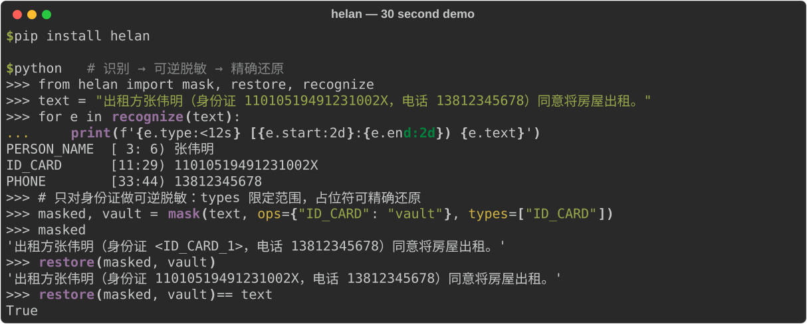

# The Veil of Hidden Names — Helan

[简体中文](README.md) · English

**Helan** is a Chinese-first Python library for detecting and masking personal data before it enters an LLM, RAG, or data-processing pipeline.

[](https://pypi.org/project/helan/)
[](https://pypi.org/project/helan/)
[](https://github.com/cloudydreamland/TheVeilOfHiddenNames/actions/workflows/ci.yml)
[](LICENSE)



Helan validates structured Chinese identifiers with their official checksum rules, returns offsets into the original text, and can either irreversibly mask a match or restore it later from a protected vault.

## Quick start

```bash
python -m pip install helan
```

Or install from source (latest development version):

```bash
git clone https://github.com/cloudydreamland/TheVeilOfHiddenNames.git
cd TheVeilOfHiddenNames
python -m pip install .
```

```python
from helan import mask, restore, recognize

text = "联系张伟：身份证 11010519491231002X，电话 13812345678。"

for entity in recognize(text):
    assert entity.text == text[entity.start:entity.end]

# Only treat ID cards: the placeholder is reversible via the vault.
# Without `types=`, every detected type is masked with its default operator.
masked, vault = mask(text, ops={"ID_CARD": "vault"}, types=["ID_CARD"])
assert restore(masked, vault) == text
```

The CLI supports scanning, masking, restoring, and running the built-in evaluation:

```bash
helan scan contract.txt --json
helan mask contract.txt -o masked.txt --ops ID_CARD:vault,PHONE:partial --vault-out vault.json
helan restore masked.txt --vault vault.json -o restored.txt
helan eval
```

## What it provides

- Checksum validation for mainland Chinese ID cards, bank cards, and unified social credit codes; strict mobile-number prefixes.
- Chinese-aware rules for contact, network, and context-dependent entities.
- Reversible vault masking, partial masking, hashing, redaction, and checksum-valid synthetic identifiers.
- Exact source offsets; `entity.text == source[entity.start:entity.end]`.
- Streaming recognition and a Presidio-compatible adapter.
- No required runtime dependencies. `helan[jieba]` and the optional LLM recognizer add opt-in recall paths.

## Scope and limitations

Recognition quality depends on entity type and input context. Names and addresses use contextual rules and can produce false positives or miss variants. The built-in benchmark uses synthetic Chinese documents and is not a production accuracy guarantee. Masking is not a substitute for access control or a privacy review. A vault contains restoration data and must be protected like the original text.

## Documentation

- [简体中文](README.md)
- [Presidio comparison and migration notes](docs/presidio_zh.md)
- [Entity recognizer options](docs/ner_options.md)
- [Evaluation results](benchmarks/results.md)
- [Performance measurements](benchmarks/perf.md)
- [Changelog](CHANGELOG.md)
- [Roadmap](ROADMAP.md)
- [Gap research and methodology](GAP_PROOF.md)

## Development and security

See [CONTRIBUTING.md](CONTRIBUTING.md) for local setup. Please report security issues privately; see [SECURITY.md](SECURITY.md).

## Feedback and contributing

Use [Discussions](https://github.com/cloudydreamland/TheVeilOfHiddenNames/discussions) for questions and ideas, and [Issues](https://github.com/cloudydreamland/TheVeilOfHiddenNames/issues) for reproducible bugs. Share only synthetic or redacted minimal examples; never upload personal data, API keys, or private source text. Report security issues privately as described in [SECURITY.md](SECURITY.md).

## License

MIT. See [LICENSE](LICENSE).
